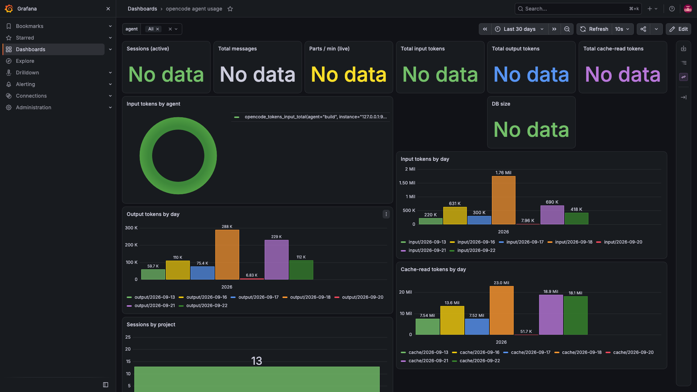

# opencode usage dashboard

> AI coded for agent monitoring — tracks opencode agent usage (tokens,
> sessions, activity) in a local Grafana dashboard.

Local Grafana dashboard (port **9999**) showing your opencode agent usage
metrics, fed by Prometheus scraping a lightweight exporter that reads
opencode's local SQLite store (`~/.local/share/opencode/opencode.db`,
read-only). Runs locally, binds all services to `127.0.0.1` only.

Stack (all Homebrew-installed, no Docker):

| Component | Port | Role |
|-----------|------|------|
| Grafana   | 9999 | dashboard UI (provisioned datasource + dashboard) |
| Prometheus | 9090 | time-series store / scraper |
| exporter.py | 9105 | reads opencode.db, exposes Prometheus metrics |

## Start / stop

    ./start.sh                 # idempotent: starts exporter, prometheus, grafana

To stop:

    pkill -f "exporter.py 9105"; pkill -f "prometheus --config.file=prometheus.yml"; pkill -f "grafana server --config=grafana/grafana.ini"

`start.sh` exports `OC_DASHBOARD_DIR` (its own directory) so `grafana.ini`
and the dashboard provider resolve paths relative to the repo — no hardcoded
user paths in the config.

## Dashboard

    http://127.0.0.1:9999/d/opencode-usage/opencode-agent-usage

Anonymous/Viewer access is enabled; data source is `Prometheus` (localhost:9090).
Dashboard auto-refreshes every 10s; per-day panels use cumulative-per-day
counters so history accumulates as you use opencode.

## Metrics

Cumulative counters (per agent where available; `agent` = build/explore/general):

- `opencode_sessions` / `opencode_sessions_total` — active / total sessions
- `opencode_messages_total` — cumulative messages
- `opencode_tokens_input_total`, `opencode_tokens_output_total`,
  `opencode_tokens_reasoning_total` — token usage
- `opencode_tokens_cache_read_total`, `opencode_tokens_cache_write_total`
- `opencode_cost_total` — spend (note: local DB currently stores 0)
- `opencode_usage_per_day{metric,day,agent}` — per-day token breakdown
- `opencode_cost_per_day{agent,day}`
- `opencode_project_sessions_total{project}` — sessions per project dir
- `opencode_latest_parts_per_minute` — live activity gauge
- `opencode_db_size_bytes`, `opencode_db_page_count`
- `opencode_up`

## Files

- `exporter.py` — metrics exporter (std. lib only)
- `prometheus.yml` — scrape config ~/opencode-dashboard/data-prom storage
- `grafana/grafana.ini` — grafana on port 9999, anonymous view
- `grafana/provisioning/datasources/datasource.yml` — Prometheus DS
- `grafana/provisioning/dashboards/dashboards.yml` — file provider
- `grafana/dashboards/opencode-usage.json` — the dashboard
- `verify_panels.py` — smoke-tests every panel expression through
  Grafana->Prometheus proxy (bypasses macOS system proxy at 127.0.0.1:8080)

## Notes

- exporter opens the DB with `mode=ro&immutable=1`; safe to run while
  opencode is active (WAL).
- Grafana `/api/datasources/proxy` is deprecated in v13; panels query via
  `/api/ds/query`, which is what `verify_panels.py` exercises.
- Prometheus retention default (15d); drop `data-prom/` to reset history.